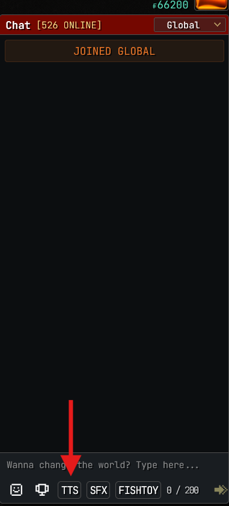
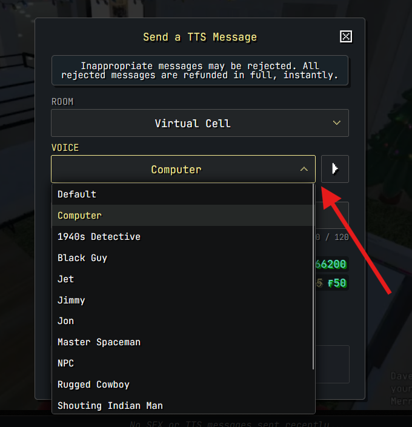
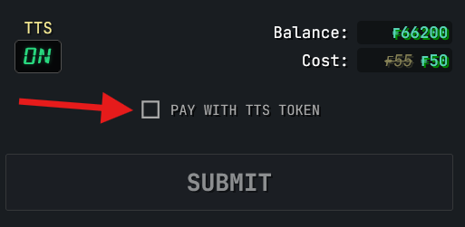
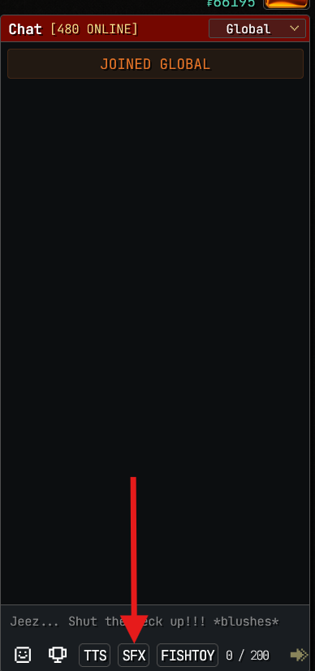
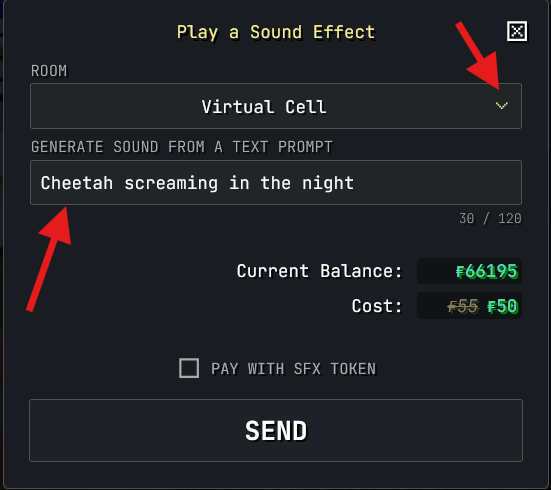
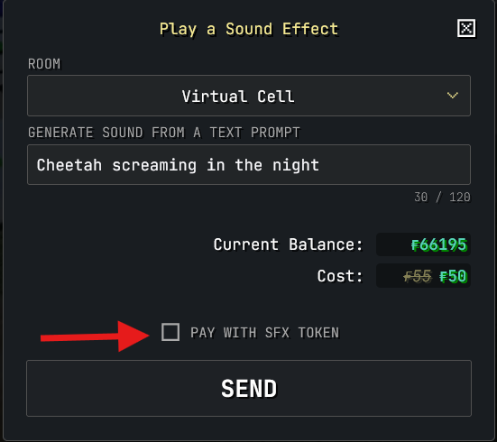

## TTS Messages

Viewers can participate in the stream by sending TTS (text-to-speech) messages that will play across speakers in a particular room chosen.

1. To send a TTS message, first select the TTS button just above the chat
   

2. Select the voice you want the TTS message to use while playing to the Fish
   

### TTS Tokens

If you are lucky enough to generate a TTS Token, you can choose to use the token when sending your TTS message by selecting the checkbox that states 'Pay with TTS Token'

## SFX (Sound Effects)

Viewers can participate in the stream by sending an SFX (AI Generated Sound Effects) that will play across in the room chosen by the viewer.

1. To send a SFX message, first select the SFX button just above the chat
   

2. Choose which room you want the SFX played in and then enter in the description of the sound effect you want to generate. Magic at your fingertips!
   

### SFX Tokens

If you're lucky enough to generate a SFX token, you can choose to consume the token by selecting the 'Pay with SFX Token' option

